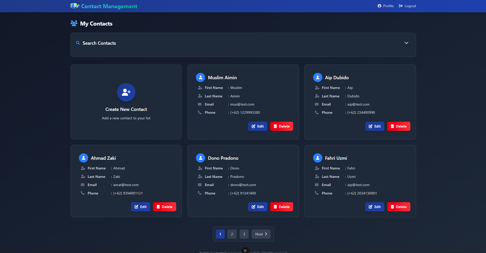
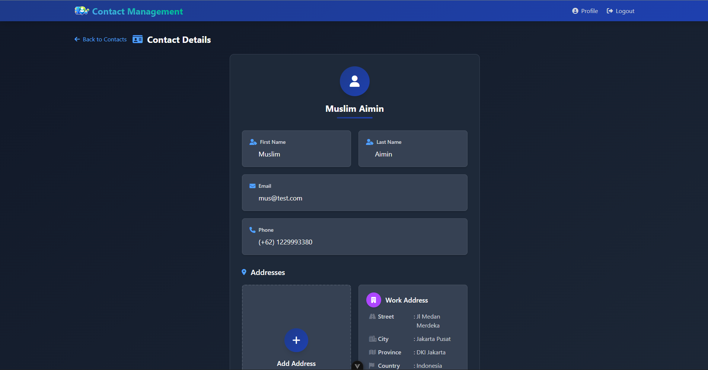

<div align="center" style="overflow: hidden; border-radius: 20px">


</div>

<div align="center">

[](https://vuejs.org/) [](https://router.vuejs.org/) [](https://vitejs.dev/) [](https://tailwindcss.com/) [](https://axios-http.com/) [](https://sweetalert2.github.io/)
</div>

A Vue 3 single-page application demonstrating modern frontend architecture with guest browsing, JWT-based authentication, and full CRUD operations for contacts and addresses. Built as a portfolio project to showcase practical Vue.js skills and frontend engineering decisions.

**Live Features:** Public contact directory, user registration/login with token refresh, protected dashboard with contact/address management, profile updates, and optimized lazy-loaded routes.

---

## 📋 About This Project

This is a **personal learning and portfolio project** built to demonstrate:

- Vue 3 Composition API and component patterns
- JWT authentication with token refresh
- Route guards and lazy loading
- API integration with loading states

**Note:** This is a frontend-only project consuming a REST API. It focuses on client-side engineering and does not include backend implementation.

---

## 🎯 Key Engineering Highlights

### Performance Optimization

- **Manual Rollup chunk splitting** for faster loads
- **Lazy-loaded routes** with dynamic imports
- **Skeleton loaders** for perceived performance

### Authentication & Security

- **JWT access/refresh token** flow with auto-refresh on 401
- **Route guards** for protected pages
- **Combined cookies + sessionStorage** for session persistence

### Component Architecture

- **Vue 3 Composition API** (`ref`, `reactive`, `computed`)
- **Nested routes** for hierarchical data
- **Reusable** service layer and components

---

## ✨ Features

- 🔍 **Guest Mode:** Browse public contacts with search/pagination without authentication
- 🔐 **Auth Flow:** Register, login, logout with token-based session management
- 📇 **Dashboard CRUD:** Full create/read/update/delete for contacts and nested addresses
- 👤 **Profile Management:** Update display name and password
- 🎨 **Modern UX:** Gradient UI, loading states, collapsible search, animated skeletons

---

## 🛠️ Tech Stack

**Core Framework & Build**

- [](https://vuejs.org/) Composition API, reactive state management, lifecycle hooks
- [](https://router.vuejs.org/) Client-side routing with navigation guards and lazy-loading
- [](https://vitejs.dev/) Lightning-fast dev server with manual Rollup configuration for optimized builds

**Styling & UI**

- [](https://tailwindcss.com/) Utility-first styling via @tailwindcss/vite plugin
- [](https://sweetalert2.github.io/) User-friendly modal confirmations and error alerts

**Data & State**

- [](https://axios-http.com/) HTTP client with interceptors for auth headers and token refresh
- [](https://vueuse.org/) Composables for URL search params and reactive utilities
- [](https://www.npmjs.com/package/universal-cookie) Client-side cookie management for JWT tokens

**Developer Experience**

- [](https://eslint.org/)  [](https://prettier.io/) Code quality and consistent formatting

---

## 🗺️ Application Architecture

**Public Routes** (No Auth Required)

- `/` – Guest contact list with search/pagination
- `/guest/contacts/:id` – Contact detail with nested address list
- `/register` & `/login` – User authentication forms

**Protected Routes** (Auth Required)

- `/dashboard` – Authenticated contact list with CRUD actions
- `/dashboard/contacts/:id` – Contact detail with editable addresses
- `/dashboard/contacts/create` & `/:id/edit` – Contact forms
- `/dashboard/contacts/:id/addresses/add` & `/:id/edit` – Address forms
- `/dashboard/users/profile` – User profile update form

**Guards:** Check token → redirect guests to `/login`, authed users to `/dashboard`

---

## 🔑 API Integration & Authentication

**Flow**

1. Request → Add `Authorization: Bearer <token>`
2. Call REST API (users, contacts, addresses)
3. On 401 → Refresh token → Retry request

**Auth**

- Login: Store tokens in cookies, user in sessionStorage
- Logout: Clear cookies + sessionStorage
- Failed refresh: Redirect to login

**Services:** Modular API layer in `src/lib/api/`

---

## ▶️ Getting Started

**Prerequisites**

- Node.js ^20.19.0 or >=22.12.0
- Backend API running (configure endpoint via `.env`)

**Installation & Development**

```sh
# Install dependencies
npm install

# Start dev server (with hot reload)
npm run dev

# Lint & format code
npm run lint
npm run format
```

**Production Build**

```sh
# Build optimized bundle with code-splitting
npm run build

# Preview production build locally
npm run preview
```

**Environment Setup**
Create `.env` in project root

---

## 🎨 UX & Design Decisions

**Visual Design**

- Dark-themed gradient UI with custom Tailwind extensions (Poppins font, custom shadows)
- Card-based layouts with hover effects and smooth transitions
- Responsive grid system adapting to mobile/tablet/desktop

**Loading States**

- Custom skeleton loaders for lists and detail views (reduce perceived load time)
- Button-level loading indicators with spinner animations
- Disable form inputs during data fetching to prevent duplicate submissions

**User Feedback**

- SweetAlert2 modals for success confirmations, errors, and destructive actions
- Inline validation feedback on forms
- Toast-style alerts (via SweetAlert) for transient notifications

**Search & Pagination**

- Collapsible search panels with URL state persistence (@vueuse/core)
- Page size optimization: guest (6), dashboard (5) items per page
- Loading overlay on pagination to prevent interaction during fetch

---

## 📚 Skills Demonstrated

This project showcases practical frontend engineering skills including:

✅ **Vue 3** – Composition API, reactivity, lifecycle, composables
✅ **Routing** – Nested routes, guards, lazy-loading
✅ **State** – Component state, URL sync, session persistence
✅ **Build** – Rollup chunks, tree-shaking, env config
✅ **API** – Axios interceptors, service layer, token refresh

---

## ⚠️ Known Limitations

As a learning/portfolio project, there are deliberate trade-offs:

- **Security:** Tokens stored in non-httpOnly cookies (vulnerable to XSS). Production apps should use httpOnly cookies set by the backend.
- **Validation:** Minimal client-side validation; relies on backend error messages. Real-world apps benefit from schema validation (Zod, Yup).
- **Auth Guards:** Presence-based only (no token expiry checks or role-based access). Production needs more robust auth logic.
- **Error Handling:** Modal alerts block user interaction. Toast notifications or error boundaries would improve UX.
- **Offline Support:** No service worker or cache strategy. Data refetched on every navigation.

---

## 🖼️ Screenshots

### Dashboard - Contact List

Authenticated view with search, pagination, and CRUD actions.



### Contact Detail Page

Nested address management with edit/delete capabilities.



### Profile Management

User profile update form with password change.


---

## 🚀 Future Improvements

Potential enhancements if continuing this project:

- Pinia for shared state
- Tests (Vitest + Cypress)
- Form validation (VeeValidate + Zod)
- Infinite scroll / virtual lists
- Toast notifications
- Theme toggle
- Service worker

---

## 📝 License

This project is for portfolio and learning purposes. Feel free to explore the code and use it as a reference for your own learning.
